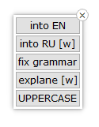
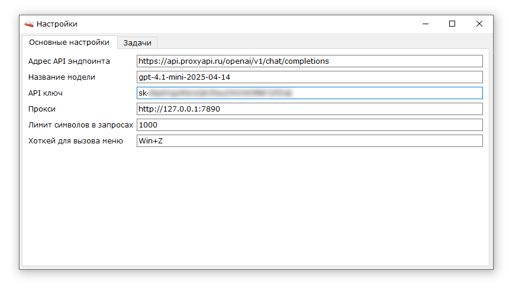
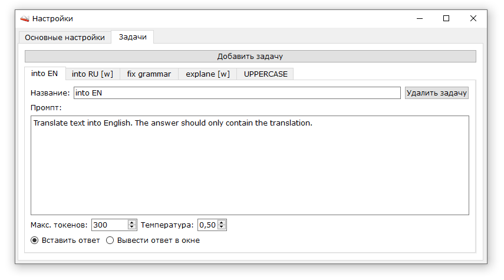
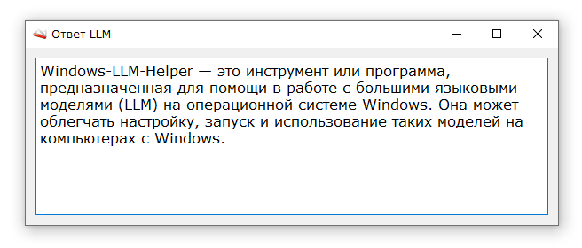

# Windows-LLM-Helper

Приложение позволяет быстро обрабатывать любой выделенный текст с помощью заранее настроенных задач.

Каждая задача содержит свой настраиваемый промпт для генерации результата. При выборе задачи программа автоматически копирует текущий выделенный текст, отправляет его вместе с промптом на указанный API-эндпоинт LLM и возвращает результат — либо вставляя его в текущее приложение, либо открывая отдельное окно с ответом.

---

**Основные возможности:**
- Глобальный хоткей для вызова меню задач
- Поддержка вставки ответа напрямую в текущее приложение или отображения в отдельном окне
- Настраиваемые промпты, лимиты токенов и температура генерации

## Скриншоты

#### Меню выбора задачи для работы с выделенным текстом

#### Основные настройки

#### Настройка задач

#### Окно вывода результата
