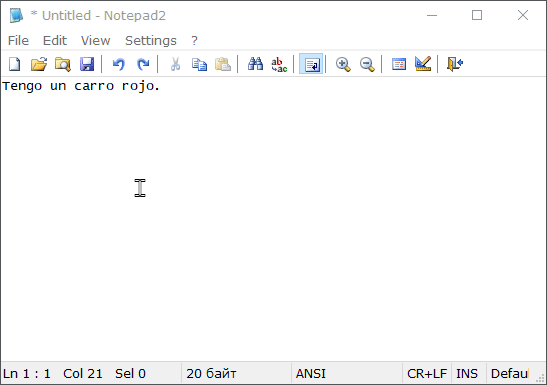
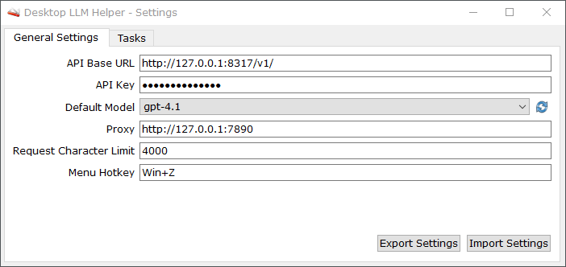
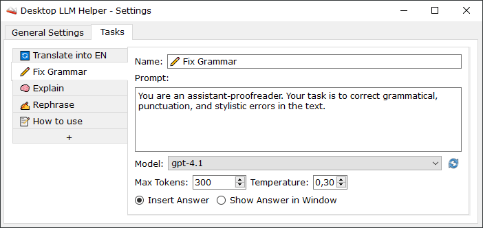
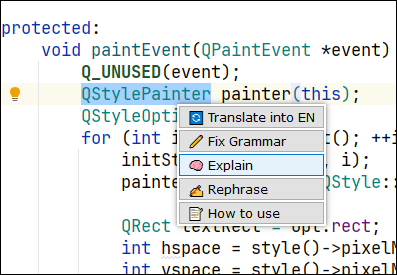
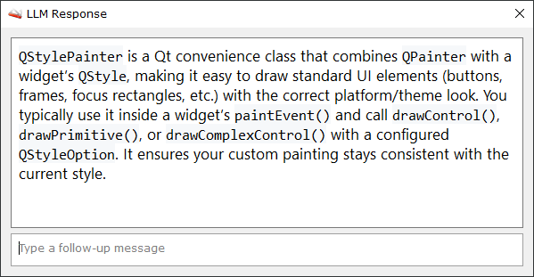

<div align="center">
  

# Desktop LLM Helper

A Windows desktop application that enables seamless text processing with Large Language Models from any application.
Select text anywhere, trigger a hotkey, and instantly send it to your LLM for processing. Results can be inserted
directly back into your workflow or displayed in an interactive chat dialog.

  
</div>

## Features

- **System-wide hotkey integration**: Access LLM capabilities from any application
- **Customizable task presets**: Configure multiple tasks with different prompts and behaviors
- **Flexible response handling**:
    - **Insert Mode**: Automatically paste LLM responses directly into the active application
    - **Dialog Mode**: View responses in a dedicated chat window with conversation history
- **Clipboard integration**: Seamlessly captures selected text and returns results via system clipboard
- **Multiple LLM provider support**: Works with OpenAI-compatible API endpoints

## How It Works

1. **Configure Tasks**: Set up custom tasks with specific prompts (e.g., "Translate to English", "Fix Grammar", "Explain
   Concept")
2. **Set Global Hotkey**: Define a system-wide keyboard shortcut to trigger the task menu
3. **Use Anywhere**: Select text in any application and press your configured hotkey
4. **Choose Task**: A popup menu displays your configured tasks
5. **Automatic Processing**:
    - The application captures the selected text (simulates Ctrl+C)
    - Sends it to your LLM with the task's prompt
    - Returns the response based on your configuration:
        - **Insert Answer**: Automatically pastes the result (simulates Ctrl+V)
        - **Show in Window**: Opens an interactive chat dialog for further conversation

## Use Cases

- Translation between languages
- Grammar and spelling correction
- Text rephrasing and style adjustment
- Technical term explanations
- Code documentation and refactoring
- Summarization and content analysis
- And many more...

---

## How to Use

1. Find the tray icon and open Settings.

   

2. Configure the LLM connection (API base URL, API key, hotkey), then save the settings.

   

3. Open **Tasks** and create the tasks you want to run (prompt, model, response mode).

   

4. Select text in any app and press the configured **hotkey** (`Ctrl+Shift+Space` by default) to open the task menu.

   

5. Run a task. The response is either inserted into the current text field or shown in a dialog, depending on the task settings.

   

## Example Tasks and Prompts

These examples are ready-to-use task presets. Use **Insert Answer** for tasks that should replace or paste text directly,
and **Show in Window** for tasks where you may want to continue the conversation.

### Translation and Writing

**Translate to English**  
Recommended mode: **Insert Answer**

```text
You are a translation engine. Translate the user's message into natural English only.
Do not answer the message. Do not add explanations. Output only the translation.
```

**Translate to Russian**  
Recommended mode: **Insert Answer**

```text
You are a translation engine. Translate the user's message into Russian only.
Do not answer the message. Do not add explanations. Output only the translation.
```

**Fix Grammar**  
Recommended mode: **Insert Answer**

```text
Correct grammar, spelling, punctuation, and word choice in the user's text.
Preserve the original meaning and tone. Output only the corrected text.
```

**Improve Clarity**  
Recommended mode: **Insert Answer**

```text
Rewrite the user's text to make it clearer, more concise, and easier to read.
Preserve the original meaning. Output only the improved text.
```

**Rephrase**  
Recommended mode: **Insert Answer**

```text
Rephrase the user's text in a natural way while preserving its meaning.
Do not add explanations. Output only the rewritten text.
```

**Make It More Professional**  
Recommended mode: **Insert Answer**

```text
Rewrite the user's text in a professional, polished tone.
Keep the message clear and direct. Output only the rewritten text.
```

**Make It Friendlier**  
Recommended mode: **Insert Answer**

```text
Rewrite the user's text in a warmer, friendlier tone.
Keep the original meaning. Output only the rewritten text.
```

**Shorten Text**  
Recommended mode: **Insert Answer**

```text
Make the user's text shorter and more concise without losing the key meaning.
Output only the shortened text.
```

**Expand Draft**  
Recommended mode: **Show in Window**

```text
Expand the user's draft into a complete, well-structured version.
Keep the original intent and ask follow-up questions if important details are missing.
```

### Understanding and Research

**Explain**  
Recommended mode: **Show in Window**

```text
Explain the selected text clearly and practically.
Assume the user is technical but may be unfamiliar with this specific topic.
Use examples when helpful.
```

**Summarize**  
Recommended mode: **Show in Window**

```text
Summarize the user's text into the most important points.
Use concise bullet points and preserve concrete facts, decisions, and action items.
```

**Extract Action Items**  
Recommended mode: **Show in Window**

```text
Extract action items from the user's text.
For each item, include the task, owner if mentioned, deadline if mentioned, and any open questions.
```

**Explain Like I'm New to This**  
Recommended mode: **Show in Window**

```text
Explain the user's text in simple terms for someone new to the topic.
Avoid jargon where possible. Define important terms briefly.
```

**Find Risks and Ambiguities**  
Recommended mode: **Show in Window**

```text
Review the user's text for risks, ambiguous wording, hidden assumptions, and missing information.
List the issues first, then suggest concrete improvements.
```

### Email and Messaging

**Write a Reply**  
Recommended mode: **Show in Window**

```text
Draft a clear and useful reply to the selected message.
Match the tone of the conversation. If information is missing, include placeholders or brief questions.
```

**Make Email Polite and Direct**  
Recommended mode: **Insert Answer**

```text
Rewrite the user's email to be polite, direct, and professional.
Preserve the intent and avoid unnecessary formality. Output only the rewritten email.
```

**Turn Notes into Message**  
Recommended mode: **Show in Window**

```text
Turn the user's notes into a clear message.
Organize the ideas, remove duplication, and keep the result practical and easy to send.
```

### Development

**Explain Code**  
Recommended mode: **Show in Window**

```text
Explain what the selected code does.
Focus on control flow, important data structures, side effects, and any non-obvious behavior.
```

**Review Code**  
Recommended mode: **Show in Window**

```text
Review the selected code for bugs, edge cases, maintainability issues, and missing error handling.
Prioritize concrete findings. Include suggested fixes when possible.
```

**Add Code Comments**  
Recommended mode: **Insert Answer**

```text
Add concise, useful comments to the selected code.
Do not comment obvious lines. Preserve the code behavior and formatting as much as possible.
Output only the updated code.
```

**Generate Commit Message**  
Recommended mode: **Insert Answer**

```text
Write a concise Git commit message for the selected diff or change summary.
Use imperative mood. Output only the commit message.
```

### Productivity

**Create Checklist**  
Recommended mode: **Show in Window**

```text
Convert the user's text into a practical checklist.
Group related items, remove duplicates, and keep each item actionable.
```

**Extract Key Facts**  
Recommended mode: **Show in Window**

```text
Extract the key facts from the user's text.
Preserve names, dates, numbers, constraints, and decisions. Do not add unsupported assumptions.
```

**Turn Text into Table**  
Recommended mode: **Show in Window**

```text
Convert the user's text into a clean Markdown table.
Choose useful columns based on the content. Preserve all important details.
```

**Brainstorm Alternatives**  
Recommended mode: **Show in Window**

```text
Suggest practical alternatives to the user's selected idea or wording.
Include tradeoffs and recommend the best option for a typical professional context.
```


---

## Build

Requirements:

- Windows
- Qt 6.x (mingw_64) with Widgets and Network
- CMake 3.16+ (Qt Tools)
- Ninja (Qt Tools)
- MinGW (Qt Tools)

Example build using Qt Tools (CMake + Ninja + MinGW):

```
"C:\Qt\Tools\CMake_64\bin\cmake.exe" -S . -B cmake-build-debug -G Ninja ^
  -DCMAKE_CXX_COMPILER="C:/Qt/Tools/mingw1310_64/bin/g++.exe" ^
  -DCMAKE_RC_COMPILER="C:/Qt/Tools/mingw1310_64/bin/windres.exe" ^
  -DCMAKE_MAKE_PROGRAM="C:/Qt/Tools/Ninja/ninja.exe" ^
  -DQT_DIR="C:/Qt/6.8.1/mingw_64/lib/cmake/Qt6"
"C:\Qt\Tools\CMake_64\bin\cmake.exe" --build cmake-build-debug
```
